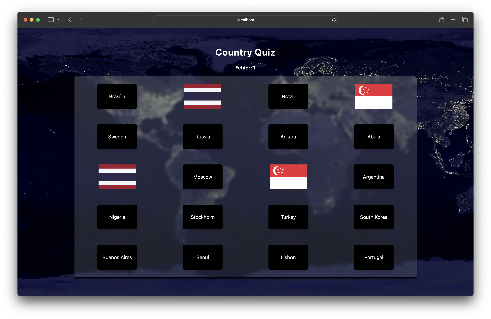

# Country Quiz

Coutry Quiz ist eine React App, in der Hauptstädte zu Ländern zugeordnet werden müssen.
Die App wurde zum Üben von React und Tailwind erstellt.
Flaggen Svg von https://github.com/hampusborgos/country-flags?tab=readme-ov-file

## Grundidee

https://www.youtube.com/watch?v=XTgB4esy1is

## Ausführen

```
npm install
npm run dev

```

## Screenshot


